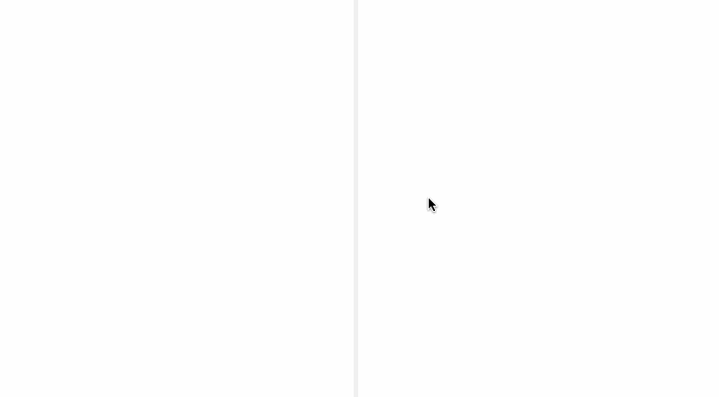

# vue-split-pane

> Adjustable split pane using Vue.js



## Install

```
# yarn (recommend)
$ yarn add vue-split-pane

# npm
$ npm install vue-split-pane --save
```

## Usage

### .vue files

```html
<template>
  <div class="app">
    <split-pane>
      <section slot="left">Left Pane</section>
      <section slot="right">Right Pane</section>
    </split>
  </div>
</template>

<script>
import SplitPane from 'vue-split-pane'

export default {
  components: { SplitPane }
}
</script>
```

## Slot

| Name           | Description                              |
| -------------- | ---------------------------------------- |
| `left`         | The content of left pane                 |
| `right`        | The content of right pane                |

## Build Setup

You can use [vue-cli](https://github.com/vuejs/vue-cli) with [vue-rollup-boilerplate templates](https://github.com/dangvanthanh/vue-rollup-boilerplate) or [other vue templates](https://github.com/vuejs-templates)

## License

MIT © Dang Van Thanh <dangvanthanh@dangthanh.org>
